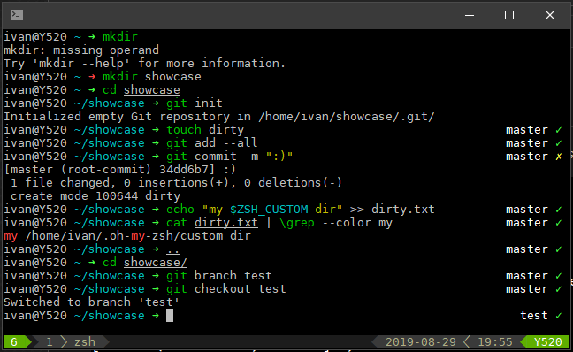

# zsh_theme
My custom made Oh-My-Zsh theme. Fast, simple and not bloated with useless information.

Best if used with common zsh plugins, [tmux](https://github.com/tmux/tmux/wiki) and [vim-airline](https://github.com/vim-airline/vim-airline).

# Installation

Use `setup.sh` script on an existing Oh-My-Zsh installation. This will hard-link the theme file to your Oh-My-Zsh directory. After that, simply change the theme in your `.zshrc` file (follow instructions in the script).

